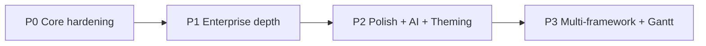

# db-grid ↔ AG Grid Feature Implementation Plan

> Source of truth scraped from [ag-grid.com/react-data-grid](https://www.ag-grid.com/react-data-grid/) (docs nav, Key Features, Community vs Enterprise, Filtering, Charting, AI Features — as of Jul 2026).  
> Goal: bring `@deepbratt55/db-grid` + `@db-grid/charts` to **full AG Grid Community + Enterprise parity**, then keep db-grid–specific advantages (PostgreSQL SSRM, licensing dashboard, AI filter, realtime WS).

---

## Status legend

| Mark | Meaning |
|------|---------|
| ✅ | Implemented (usable in demo) |
| 🟡 | Partial / scaffold only — needs depth to match AG Grid |
| ❌ | Not started |
| 🚀 | DbGrid ahead of AG Grid (keep & deepen) |

---

## Executive gap summary

> **Live parity (358 React docs pages):** **324 done · 0 partial · 34 N/A**  
> Tracker: http://localhost:5173/features · `packages/db-grid/src/parity/agGridSlugs.ts`

| Area | AG Grid | DbGrid today | Priority |
|------|---------|----------------|----------|
| Core columns / cells / sort / filter / edit | Full | ✅ | — |
| Virtualization & performance | World-class | ✅ Row + col virt | — |
| Filtering suite | Full | ✅ + multi/advanced/BigInt | — |
| Editing suite | Full | ✅ Full-row/batch/rich/large | — |
| Row models | Full | ✅ Client/infinite/SSRM/viewport | — |
| Group / agg / pivot / tree / master-detail | Enterprise | ✅ | — |
| Charts + sparklines | Enterprise | ✅ | — |
| Accessories | Full | ✅ + QAT, notes, formula bar | — |
| Import / export | Full | ✅ CSV import + Excel export | — |
| Theming API | Full | ✅ ThemeParams presets | Theme Builder UI polish |
| AI / MCP | New | ✅ NL filter | MCP deep optional |
| Angular / Vue / SolidJS | Yes | N/A (React-first) | P3 |
| Custom licensing + PG SSRM | — | 🚀 Ahead | — |

---

## Phase roadmap (recommended order)



| Phase | Duration (est.) | Outcome |
|-------|-----------------|--------|
| **P0** | 3–4 weeks | Production-usable Community parity |
| **P1** | 4–6 weeks | Enterprise feature depth matching AG docs |
| **P2** | 3–4 weeks | Theming API, AI toolkit, state/lifecycle, perf |
| **P3** | 4+ weeks | Angular/Vue, Gantt, dashboards, design system |

---

## 1. Getting Started / Architecture

| AG Grid feature | Status | Plan | Target files |
|-----------------|--------|------|--------------|
| Modular packages (`AllCommunityModule`, tree-shaking) | ❌ | Split `@deepbratt55/db-grid` into modules: `ClientSideRowModel`, `CsvExport`, `RowGrouping`, `Charts`, etc. Add `DbGridProvider` + `modules` prop | `packages/db-grid/src/modules/*`, `DbGridProvider.tsx` |
| Quick Start API parity (`AgGridReact` alias) | 🟡 | Keep `AgGridReact` export; add `moduleRegistry` | `packages/db-grid/src/index.ts` |
| Framework adapters | ❌ | After React is solid: `@db-grid/angular`, `@db-grid/vue`, `@db-grid/vanilla` | new packages |

---

## 2. Layout & Styling

Docs: [Theming](https://www.ag-grid.com/react-data-grid/theming/), Design System, Grid Layout

| Feature | Status | Plan | Target |
|---------|--------|------|--------|
| Quartz / Alpine / Balham / Material themes | 🟡 | Real theme tokens (spacing, colors, fonts) via CSS variables + JS theme objects | `styles/themes/*.css`, `theme/createTheme.ts` |
| Theme `withParams` API | ❌ | `themeDb.withParams({ spacing, foregroundColor, ... })` like AG | `theme/themeApi.ts` |
| Theme Builder UI | ❌ | Vite app `apps/theme-builder` — visual token editor → codegen | `apps/theme-builder` |
| Grid layout (`domLayout`: normal / autoHeight / print) | 🟡 | Wire `domLayout` prop (typed, mostly unused) | `DbGrid.tsx` |
| `cellClassRules` / `rowClassRules` | ✅ | Rule maps → class names | `ColumnDef`, row render |
| Design System / Figma | ❌ | Document tokens; optional Figma kit later | `docs/design-tokens.md` |

---

## 3. Charting

Docs nav: Sparklines, Integrated Charts, Standalone Charts, Dashboards, Gantt Charts

| Feature | Status | Plan | Target |
|---------|--------|------|--------|
| Sparklines (line/bar/area/column) | 🟡 | Multi-type sparklines + markers + axis options | `components/Sparkline.tsx`, `charts/sparklines/*` |
| Integrated charts from range | 🟡 | Chart menu, chart tool panel, series/category picker, update on data change | `components/ChartPanel.tsx`, `hooks/useIntegratedCharts.ts` |
| Chart types (combo, stacked, histogram, OHLC, heatmap…) | 🟡 | Expand `@db-grid/charts` or optional Canvas/WebGL engine | `packages/db-charts` |
| Standalone charts library | 🟡 | Export `DbChart` as first-class; docs + examples | `packages/db-charts` |
| Dashboard composition | ❌ | Grid + multiple charts synced via shared filter model | `apps/demo` dashboard page |
| Gantt charts | ❌ | New `@db-grid/gantt` (timeline rows, dependencies) — P3 | new package |

---

## 4. Core — Columns

Docs: Columns (defs, groups, moving, pinning, sizing, headers, menus)

| Feature | Status | Plan | Target |
|---------|--------|------|--------|
| `field` / `colId` / `headerName` | ✅ | — | `types.ts` |
| `valueGetter` / `valueFormatter` / `valueSetter` | ✅ | — | `dataOps.ts` |
| Column resize / flex / min/max width | ✅ | — | `DbGrid.tsx` |
| Pin left/right | ✅ | Sticky pins + center column virtualization | `DbGrid.tsx` pinned sections |
| Column move (drag reorder) | ❌ | Header drag-and-drop → reorder `columnDefs` | `components/HeaderRow.tsx` |
| Column groups (`children` header groups) | 🟡 | Type exists; render multi-row headers | `components/ColumnGroupHeader.tsx` |
| Auto-size / size-to-fit | ✅ | Deepen measurement via canvas text metrics | `api.autoSizeAllColumns` |
| Column menu (filter, pin, agg, reset) | ✅ | AG-style header menu button | `components/ColumnMenu.tsx` |
| Column state save/restore | 🟡 | `getColumnState` / `applyColumnState` exist; add persist helpers | `api` + `state/columnState.ts` |
| Calculated columns | ❌ | UI + formula column factory (AG 36 highlight) | `features/calculatedColumns.ts` |

---

## 5. Core — Rows

| Feature | Status | Plan | Target |
|---------|--------|------|--------|
| Row IDs (`getRowId`) | ✅ | — | props |
| Row height / variable row height | 🟡 | Fixed height only → `getRowHeight` + virt index map | `useVirtualization.ts` |
| Row hover / animation | 🟡 | CSS animate flag | CSS |
| Full-width rows | ❌ | `isFullWidthRow` + renderer | `DbGrid.tsx` |
| Row dragging (reorder / external) | ❌ | Drag handle column | `features/rowDrag.ts` |
| Pinned top/bottom rows | ✅ | Pin containers outside virt scroll | `DbGrid.tsx` |
| Row spanning | ❌ | Cell merge layout | `features/rowSpanning.ts` |

---

## 6. Core — Cells

| Feature | Status | Plan | Target |
|---------|--------|------|--------|
| Cell renderer components | ✅ | Support class + memo wrappers | `DbGrid.tsx` |
| Cell data types (auto infer) | ✅ | Infer string/number/boolean/date → default filter/editor | `utils/dataTypes.ts` |
| Tooltips | 🟡 | `tooltipField` typed; wire native/custom tooltip | `components/Tooltip.tsx` |
| Cell flash on update | ❌ | Flash CSS on transaction update | `features/flashCells.ts` |
| Cell notes / comments (AG recent) | ❌ | Note overlay store per cell | `features/cellNotes.ts` |

---

## 7. Core — Filtering

Docs: Text, Number, BigInt, Date, Set (e), Multi (e), Floating, Advanced, Quick, External

| Feature | Status | Plan | Target |
|---------|--------|------|--------|
| Quick filter | ✅ | — | pipeline |
| Text / number operators | 🟡 | Move UI into **column menu** + floating row | `filters/*` |
| Date filter (calendar) | ✅ | Date picker filter model | `filters/DateFilter.tsx` |
| Set filter (Excel-like) (e) | ✅ | Unique values list + search + select all | `filters/SetFilter.tsx` |
| Multi filter (e) | ❌ | Compose text + set | `filters/MultiFilter.tsx` |
| Floating filters | ✅ | Second header row bound to filter model | `components/FloatingFilterRow.tsx` |
| Advanced filter builder (e) | ❌ | Expression tree UI | `filters/AdvancedFilter.tsx` |
| External filter | ✅ | `isExternalFilterPresent` / `doesExternalFilterPass` | props + pipeline |
| Filter API parity | 🟡 | Expand `setFilterModel` / `getFilterModel` | api |

**P0 deliverable:** column-menu filters + floating filters + date + set filter.

---

## 8. Core — Selection

| Feature | Status | Plan | Target |
|---------|--------|------|--------|
| Single / multi row selection | ✅ | Align API to AG `rowSelection: { mode }` object form | `useSelection.ts` |
| Checkbox selection | ✅ | Header “select all” indeterminate state | header checkbox |
| Range / cell selection (e) | 🟡 | Multi-range, fill handle, copy formatting | `useSelection.ts`, `features/fillHandle.ts` |
| Selection column lock | ❌ | Dedicated selection col | column factory |

---

## 9. Core — Editing

AG: ~8 provided editors (text, large text, select, rich select, number, date, checkbox, formula)

| Feature | Status | Plan | Target |
|---------|--------|------|--------|
| Inline text edit | ✅ | — | `DbGrid.tsx` |
| Select / rich select editors | ✅ | Dropdown editors | `editors/CellEditor.tsx` |
| Number / date / checkbox editors | ✅ | Typed editors | `editors/*` |
| Large text / popup editors | ❌ | Overlay editor | `editors/LargeTextEditor.tsx` |
| Custom `cellEditor` | ✅ | Pluggable editor component API | `types.ts` |
| Validation / parse value | 🟡 | `valueParser` / error UI | editors |
| Undo / redo | 🟡 | Works for simple field sets; batch & range undo | undo stacks |
| Fill handle (e) | ✅ | Drag corner to fill series | `features/fillHandle.ts` |
| Full row editing | ❌ | Edit mode for entire row | props |

---

## 10. Core — Updating Data

| Feature | Status | Plan | Target |
|---------|--------|------|--------|
| `setRowData` | ✅ | — | api |
| `applyTransaction` add/update/remove | 🟡 | Deepen immutable + index maps | api |
| `applyTransactionAsync` | ✅ | Batched RAF updates | api |
| Immutable data mode | ❌ | `getRowId` + replace detection | props |
| Change detection / refresh cells | ✅ | `refreshCells`, `redrawRows` | api |
| High-frequency updates | ❌ | Dirty-rect render path for trading demos | virt layer |

---

## 11. Core — Interactivity

| Feature | Status | Plan | Target |
|---------|--------|------|--------|
| Keyboard navigation | ✅ | Arrow/tab/enter cell focus model | `hooks/useKeyboardNav.ts` |
| ARIA grid roles | ✅ | Expand row/col indices, announce sorts | `DbGrid.tsx` |
| Context menu (e) | ✅ | Custom items API + defaults | `ContextMenu.tsx` |
| Find / highlight | 🟡 | Cycle matches, scroll into view | find state |
| Touch / mobile gestures | ❌ | Long-press context, swipe | later |

---

## 12. Advanced — Row Grouping (e)

| Feature | Status | Plan | Target |
|---------|--------|------|--------|
| Group by column | ✅ | — | `buildGroupTree` |
| Expand / collapse / expandAll | ✅ | — | api |
| Group display types (single/multi/groupRows) | 🟡 | Prop exists; implement layouts | grouping UI |
| Compact group column (AG recent) | ❌ | Single auto group col | `features/autoGroupColumn.ts` |
| Group footer / grand total rows | ❌ | Aggregate footer nodes | grouping |
| Open by default levels | ✅ | `groupDefaultExpanded` | — |

---

## 13. Advanced — Aggregation (e)

| Feature | Status | Plan | Target |
|---------|--------|------|--------|
| sum/avg/min/max/count/first/last | ✅ | — | `aggregate` |
| Custom agg functions | ✅ | `aggFuncs` registry | `aggregation/registry.ts` |
| Aggregation editing (AG recent) | ❌ | Edit agg cells → distribute | later |
| Show values as (% of total, etc.) | ❌ | Value display modes | pivoting |

---

## 14. Advanced — Formulas (e)

| Feature | Status | Plan | Target |
|---------|--------|------|--------|
| Cell formulas `=[field]*[field]` | 🟡 | Expand Excel-like functions (IF, ROUND, VLOOKUP lite) | `evaluateFormula` |
| Cross-row references | ❌ | Address model A1-style optional | formula engine |
| Formula bar UI | ❌ | Toolbar input | demo + core |

---

## 15. Advanced — Pivoting (e)

| Feature | Status | Plan | Target |
|---------|--------|------|--------|
| Pivot mode + pivot cols | 🟡 | Basic pivot works | `pivotData` |
| Secondary columns / pivot result cols | ❌ | Dynamic col defs from pivot keys | pivot engine |
| Pivot + SSRM | ❌ | Server pivot SQL | `apps/api` SSRM |
| Pivot panel in columns tool panel | 🟡 | Buttons exist; drag-drop zones | `ColumnsToolPanel` |

---

## 16. Advanced — Tree Data (e)

| Feature | Status | Plan | Target |
|---------|--------|------|--------|
| `treeData` + `getDataPath` | 🟡 | Builds nodes; needs selection/filter/export polish | `buildTreeDataNodes` |
| Async tree children | ❌ | Lazy load children | SSRM tree |
| File-explorer style UX | ❌ | Demo page | `apps/demo` |

---

## 17. Advanced — Master Detail (e)

| Feature | Status | Plan | Target |
|---------|--------|------|--------|
| Expand detail renderer | 🟡 | Custom renderer works | props |
| Nested DbGrid as detail | ✅ | Default detail = child grid | `components/DetailGrid.tsx` |
| Lazy detail load | ✅ | `detailCellRendererParams.getDetailRowData` | api |
| Keep detail on scroll | ❌ | Detail row height in virt model | virt |

---

## 18. Advanced — Accessories (e)

| Feature | Status | Plan | Target |
|---------|--------|------|--------|
| Columns tool panel | 🟡 | Add drag between Row Groups / Values / Pivots | `ColumnsToolPanel.tsx` |
| Filters tool panel | 🟡 | Per-column provided filters | `FiltersToolPanel.tsx` |
| Custom tool panels | 🟡 | Type exists; wire `sideBar.toolPanels` | props |
| Status bar + panels | ✅ | Counts + agg of selection (avg/sum) | `StatusBar.tsx` |
| Overlays (loading / no rows) | ✅ | — | — |
| Quick Access Toolbar (AG recent) | ❌ | Compact action bar | `components/QAT.tsx` |

---

## 19. Advanced — Server-Side Data (e)

| Feature | Status | Plan | Target |
|---------|--------|------|--------|
| SSRM `getRows` | 🟡 | Works with API/memory | `IServerSideDatasource` |
| Infinite row model | ✅ | Block cache + scroll fetch | `rowModels/infinite.ts` |
| Viewport row model | ❌ | Bidirectional viewport | `rowModels/viewport.ts` |
| SSRM grouping / pivot / agg | ❌ | Pass groupKeys; server SQL `GROUP BY` | `apps/api` + client |
| Store purge / refresh | 🟡 | `refreshServerSide` | api |
| 🚀 PostgreSQL adapter | 🚀 | Deepen: group/pivot SQL, prepared statements | `apps/api/src/routes/grid.ts` |
| 🚀 WebSocket live ticks | 🚀 | Apply ticks via `applyTransaction` | demo SSRM page |

---

## 20. Advanced — Import & Export

| Feature | Status | Plan | Target |
|---------|--------|------|--------|
| CSV export | ✅ | Selected-only, separators, headers | `exporters.ts` |
| Excel export (e) styles/formulas | ✅ | Styled SpreadsheetML via `exportExcelXlsx` | `export/excelXlsx.ts` |
| Clipboard copy/paste Excel-like (e) | 🟡 | Full paste into range + truncate/grow | clipboard hooks |
| Drag-from-Excel import | ❌ | Paste parse + CSV file drop | import |
| PDF export | ❌ | Optional | later |

---

## 21. Advanced — State & Lifecycle

| Feature | Status | Plan | Target |
|---------|--------|------|--------|
| `onGridReady` | ✅ | — | — |
| Grid state API (filter/sort/col/group) | 🟡 | Unifyмент + `getState`/`setState` blob | `state/gridState.ts` |
| Events parity (`onCellClicked`, `onRowSelected`, …) | 🟡 | Add missing event props | `types.ts` |
| Destroy / memory cleanup | ❌ | Abort fetches, clear observers | unmount |

---

## 22. Advanced — Performance

| Feature | Status | Plan | Target |
|---------|--------|------|--------|
| Row virtualization | ✅ | — | `useVirtualization` |
| Column virtualization | ✅ | Only render visible cols in X scroll | `hooks/useColumnVirtualization.ts` |
| DOM recycling | ❌ | Reuse row DOM nodes | virt |
| Debounced sort/filter | 🟡 | `debounce` util unused → wire | pipeline |
| Million-row SSRM demos | 🟡 | Seed 1M rows in PG + stress page | api + demo |

---

## 23. AI Features (AG Grid new)

Docs: AI Toolkit, MCP Server, Skills

| Feature | Status | Plan | Target |
|---------|--------|------|--------|
| 🚀 NL → filter model | 🚀 | Expand intent parser / LLM optional | `apps/api/.../ai-filter` |
| AI Toolkit (structured grid ops) | ❌ | Prompt → sort/filter/group/chart actions | `packages/db-ai` |
| MCP Server for grid | ❌ | MCP tools: filter, export, describe schema | `apps/mcp-server` |
| Agent Skills docs | ❌ | Cursor skill for db-grid usage | `.cursor/skills` |

---

## 24. db-grid–only (keep ahead of AG Grid)

| Feature | Status | Plan |
|---------|--------|------|
| Custom licensing dashboard | 🚀 | Billing webhooks, seat enforcement middleware |
| HMAC `DBG.*` license keys | 🚀 | Online validation required for production builds |
| PostgreSQL-native SSRM | 🚀 | Publish `@db-grid/pg-adapter` |
| Realtime collaboration cursors | ❌ | Presence via WS |
| Audit trail of cell edits | ❌ | Optional edit log table |

---

## Suggested file layout (target)

```
packages/db-grid/src/
  modules/           # tree-shakeable feature modules
  theme/             # Theme API
  filters/           # Text, Number, Date, Set, Multi, Advanced
  editors/           # Provided cell editors
  rowModels/         # client, infinite, serverSide, viewport
  features/          # fillHandle, rowDrag, flash, notes, ...
  state/             # column + grid state
  export/            # csv, excel xlsx, clipboard
  components/        # UI pieces (menus, floating filters, detail grid)
  hooks/
  DbGrid.tsx       # composition root (thin)
  DbGridProvider.tsx
```

---

## Sprint checklist (first 6 sprints)

### Sprint 1 — Filters & column menu (P0)
- [x] Column menu with pin / autosize / filter
- [x] Floating filter row
- [x] Date filter + Set filter
- [x] Demo: Feature Matrix page marks items green

### Sprint 2 — Editors & keyboard (P0)
- [x] Select, number, date, checkbox editors
- [x] `cellEditor` / `cellEditorParams` API
- [x] Full keyboard nav (arrows, tab, F2, escape)
- [ ] Header select-all checkbox

### Sprint 3 — Virtualization & pinned cols (P0)
- [x] Column virtualization
- [x] Sticky left/right pinned columns (real layout)
- [x] Pinned top/bottom rows
- [ ] Variable row heights (basic)
- [ ] Perf demo page (50k client rows)

### Sprint 4 — Enterprise depth (P1)
- [x] Nested detail grid
- [x] Group footers
- [x] Fill handle + multi-range selection
- [ ] Auto-group column + group footers polish
- [ ] Pivot secondary columns

### Sprint 5 — Export / clipboard / Excel (P1)
- [x] Real XLSX export with styles
- [ ] Robust paste
- [ ] Clipboard with headers option

### Sprint 6 — Charts + SSRM SQL (P1)
- [ ] Chart tool panel + more chart types
- [ ] SSRM group/pivot SQL in PostgreSQL adapter
- [x] Infinite row model

---

## Tracking in repo

| Artifact | Purpose |
|----------|---------|
| This file | Master plan vs AG Grid docs |
| `apps/demo/src/pages/FeaturesPage.tsx` | Living matrix UI — update statuses each sprint |
| GitHub issues / milestones | One issue per checklist item (optional) |
| `README.md` | Keep high-level; link here for parity work |

---

## Definition of done (feature-level)

A feature is **Done** when:

1. API matches AG Grid naming where practical (`ColDef`, events, gridOptions).
2. Documented example exists under `apps/demo` or Storybook.
3. Unit tests cover pure logic (`dataOps`, filters, pivot).
4. License gate applied for Enterprise-marked features.
5. Feature Matrix page status flips to ✅.

---

## References

- https://www.ag-grid.com/
- https://www.ag-grid.com/sitemap/ — full site index
- **[docs/AG_GRID_SITE_PAGES.md](./docs/AG_GRID_SITE_PAGES.md)** — catalog of all 1,463 scraped URLs (358 React docs pages)
- https://www.ag-grid.com/react-data-grid/
- https://www.ag-grid.com/react-data-grid/key-features/
- https://www.ag-grid.com/react-data-grid/community-vs-enterprise/
- https://www.ag-grid.com/react-data-grid/filtering/
- https://www.ag-grid.com/react-data-grid/integrated-charts/
- DbGrid codebase: `packages/db-grid`, `packages/db-charts`, `apps/api`, `apps/license-dashboard`
